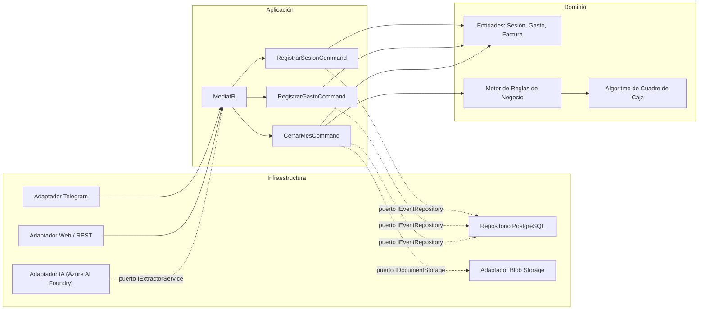
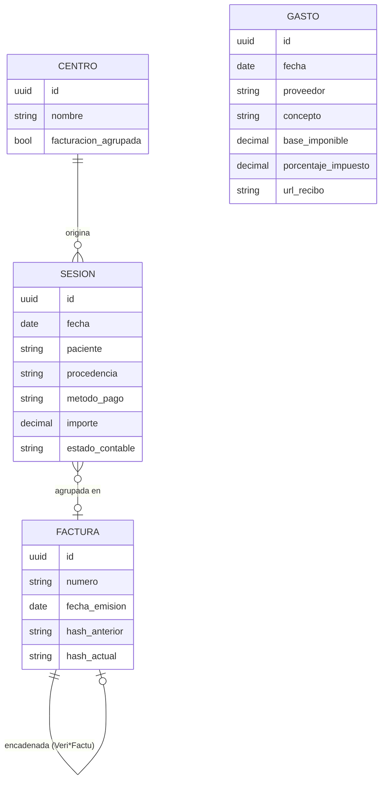
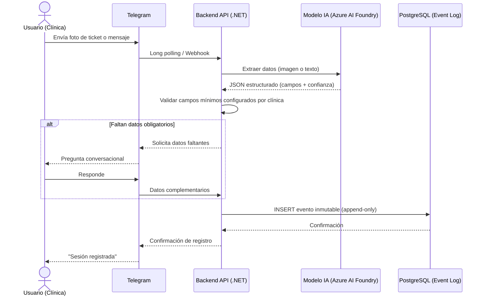
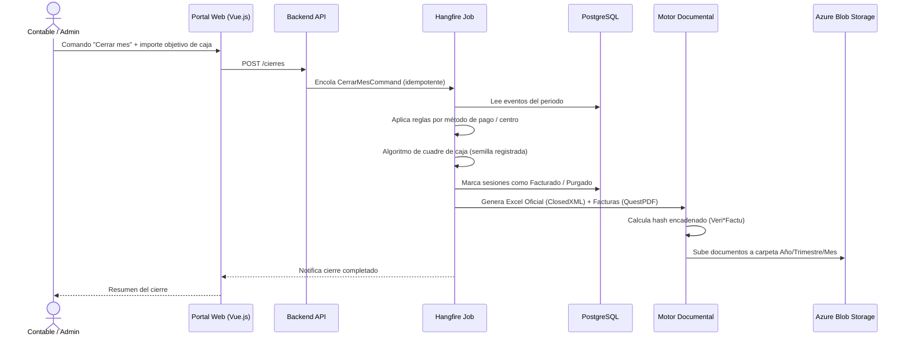
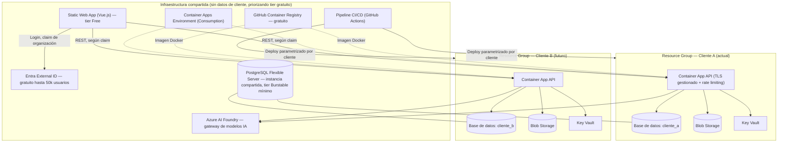
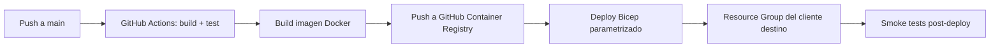

# Arquitectura Técnica — ClinicBot Core

> Este documento recoge las decisiones de arquitectura, patrones e infraestructura cerradas en la fase de diseño. Complementa a [`README.md`](./README.md), que describe el producto desde el punto de vista funcional.

## 1. Principios de diseño

1. **Dominio agnóstico de infraestructura.** Las reglas de negocio (validación, cuadre de caja, cierre de mes) no dependen de qué canal, proveedor de IA o almacenamiento se use — se aíslan detrás de puertos, y los detalles concretos (Telegram, modelo de IA, Azure Blob) son adaptadores intercambiables. El proveedor de IA en particular debe poder cambiarse mediante configuración, sin tocar código de dominio ni de aplicación.
2. **Inmutabilidad como base del libro contable.** Ningún registro validado se actualiza ni se borra; el histórico es un log de eventos append-only. Los Excel Maestro y Oficial son proyecciones derivadas de ese log, no fuentes de verdad independientes.
3. **Aislamiento físico por cliente ("silo"), no lógico.** Cada cliente tiene su propia base de datos, almacenamiento y cómputo — no hay un `TenantId` compartido separando filas de una misma tabla. Solo se comparte infraestructura que no contiene datos de negocio.
4. **El cumplimiento normativo no es una capa añadida.** Veri*Factu (cadena de huellas inmutable por emisor) y RGPD (residencia de datos en la UE, control de acceso) condicionan el modelo de datos y el despliegue desde el diseño, no se resuelven después.
5. **Coste mínimo mientras el proyecto opera con crédito de estudiante de Azure.** El crédito es finito, sin recarga automática y sin tarjeta de respaldo — cada decisión de infraestructura prioriza el tier gratuito o de menor coste disponible, incluso a costa de renunciar a servicios que serían deseables con presupuesto real (ver §11). Esto es una restricción temporal de la fase actual, no un principio permanente: se revisa en cuanto el proyecto tenga presupuesto propio.

## 2. Arquitectura de software: Hexagonal / Clean Architecture

- **Dominio**: sin dependencias externas. Contiene las entidades, el motor de reglas configurable por cliente y el algoritmo de cuadre de caja (con semilla aleatoria registrada para poder auditar por qué se purgó una sesión y no otra).
- **Aplicación**: casos de uso orquestados vía MediatR (estilo CQRS ligero).
- **Infraestructura**: adaptadores concretos — se pueden sustituir (ej. cambiar de modelo o proveedor de IA) sin tocar dominio ni aplicación. El adaptador de IA llama a **Azure AI Foundry**, que expone varios modelos (GPT-4o-mini, Mistral, Claude, etc.) bajo una misma API — cambiar de modelo es un cambio de configuración, no de código. Se empieza con el modelo más económico disponible que soporte extracción de texto e imagen con calidad suficiente.

## 3. Modelo de datos

Las sesiones y gastos se insertan como eventos inmutables; el campo `estado_contable` (`Facturado` / `Purgado`) se añade en el cierre de mes sin reescribir el resto del registro. `FACTURA` mantiene el encadenado de huellas hash exigido por Veri*Factu, con la cadena aislada por cliente (cada clínica es un NIF/emisor distinto).

## 4. Flujo: registro de una sesión o gasto

## 5. Flujo: cierre de mes

El job es idempotente: si falla a mitad, puede reintentarse sin duplicar facturas ni reordenar la cadena de huellas.

## 6. Modelo de despliegue: aislamiento por cliente optimizado en coste

**Compartido** (no almacena datos de negocio, por lo que compartirlo no compromete el aislamiento — y en la mayoría de los casos es además la opción gratuita):
- Frontend Vue.js (Azure Static Web Apps, tier Free) — mismo código para todos, enruta según el claim de organización del usuario autenticado; TLS y dominio incluidos sin coste.
- **GitHub Container Registry** en vez de Azure Container Registry — mismo rol (guardar imágenes Docker), gratuito en vez de tener un coste fijo mensual.
- Container Apps Environment (plan Consumption) — red y Log Analytics compartidos; cada Container App individual sigue siendo dedicada y se beneficia del grant gratuito mensual de vCPU/memoria y de escalado a cero.
- Tenant de Microsoft Entra External ID — clientes modelados como organizaciones separadas; gratuito muy por encima del volumen de usuarios esperado.
- Pipeline de CI/CD — misma lógica de build/deploy, parametrizada por resource group destino.
- **Servidor PostgreSQL Flexible Server** (tier Burstable más pequeño) — compartido entre clientes a nivel de *servidor*, con una **base de datos separada por cliente** dentro de él. El aislamiento de datos sigue siendo real (sin joins ni queries cruzadas posibles entre catálogos distintos sin credenciales específicas), pero el coste fijo — el único recurso que no puede escalar a cero — se paga una vez, no una vez por cliente.
- Azure AI Foundry como gateway de modelos de IA — permite empezar con el modelo más barato disponible y cambiarlo por configuración sin tocar código.

**Dedicado por cliente** (aislamiento físico real):
- Container App (instancia de cómputo que procesa datos del cliente; Consumption plan, escala a cero sin tráfico).
- Base de datos (catálogo separado dentro del servidor Postgres compartido).
- Blob Storage.
- Key Vault — incluye tanto secretos propios del cliente como cualquier credencial de plataforma (p. ej. la API key del modelo de IA), aunque el valor se repita entre clientes: cada entorno queda completamente autocontenido.

**Sin Azure Front Door ni WAF por ahora** — no tienen tier gratuito y no son sostenibles con crédito de estudiante. El ingress TLS de Container Apps y de Static Web Apps cubre el cifrado en tránsito; como mitigación compensatoria sin coste se añade rate limiting nativo de ASP.NET Core en la API, se mantiene Telegram en modo long polling (sin endpoint público adicional) y se confía en las protecciones ya incluidas gratis por Azure (DDoS Basic a nivel de red, protección de fuerza bruta de Entra External ID). Es una decisión de riesgo aceptado conscientemente para esta fase — ver §11.

Dar de alta un cliente nuevo = ejecutar la plantilla Bicep parametrizada para crear su Resource Group (Container App + base de datos en el servidor compartido + Blob Storage + Key Vault) y registrarlo contra el Environment, GitHub Container Registry y Entra ya existentes.

## 7. Pipeline de CI/CD

## 8. Resumen de decisiones tecnológicas

| Área | Decisión |
|---|---|
| Patrón arquitectónico | Hexagonal / Clean Architecture, dominio aislado, MediatR |
| Backend | ASP.NET Core (C#/.NET) |
| Frontend | Vue.js (SPA), compartido entre clientes |
| Base de datos | PostgreSQL — servidor Flexible Server **compartido** (tier Burstable mínimo), base de datos separada por cliente |
| Modelo de datos | Event log append-only + `JSONB` para configurabilidad por clínica |
| Multi-tenancy | Aislamiento físico de cómputo/storage/secretos por cliente; servidor de BD compartido con catálogo propio por cliente |
| Motor de jobs | Hangfire sobre la propia BD — idempotente |
| Generación de documentos | ClosedXML (Excel), QuestPDF (PDF, ojo a umbral de licencia Community) |
| Almacenamiento | Azure Blob Storage, dedicado por cliente |
| Canal de entrada | Telegram Bot API (long polling, sin endpoint público) |
| IA | Motor agnóstico vía **Azure AI Foundry** — modelo inicial económico (ej. GPT-4o-mini o Mistral Small), intercambiable por configuración; Claude disponible como opción de mayor calidad |
| Cómputo | Azure Container Apps, plan Consumption con escalado a cero |
| Región | Azure Spain Central (verificar cobertura de tier gratuito; West Europe como alternativa UE) |
| Identidad | Microsoft Entra External ID (clientes como organizaciones), tier gratuito |
| Exposición pública | Sin Front Door/WAF por ahora (coste); TLS nativo de Container Apps/Static Web Apps + rate limiting de ASP.NET Core como mitigación |
| Secretos | Azure Key Vault, dedicado por cliente |
| Observabilidad | Application Insights / Azure Monitor, compartido con etiquetado por cliente, dentro del tier gratuito (5GB/mes) |
| Registro de contenedores | GitHub Container Registry (gratuito), compartido |
| IaC / CI-CD | Bicep + GitHub Actions |
| Cumplimiento | RGPD + Veri*Factu |
| Presupuesto | Crédito Azure for Students — alerta de presupuesto obligatoria en Cost Management desde el primer despliegue |

## 9. Seguridad y cumplimiento

- **Veri*Factu**: cada `FACTURA` mantiene un hash encadenado con la anterior de su mismo cliente/emisor; la cadena nunca se comparte entre clientes al estar cada uno en su propia base de datos.
- **RGPD**: datos alojados en Azure Spain Central o West Europe (UE); acceso a Key Vault y Blob Storage restringido por cliente; sin telemetría de datos de paciente en Application Insights (solo metadatos técnicos, con disciplina de logging para evitar payloads sensibles).
- **Superficie pública**: el portal web y la API quedan expuestos directamente (sin Front Door/WAF delante, ver §11); Telegram se mantiene en long polling, por lo que no añade ningún endpoint público. Todo el resto de infraestructura (BD, storage, Key Vault) sin acceso público directo.
- **Mitigaciones sin WAF**: rate limiting nativo de ASP.NET Core en la API, consultas siempre parametrizadas vía EF Core (nunca SQL concatenado), protección de fuerza bruta ya incluida en Entra External ID, y DDoS Protection Basic de Azure (gratuito, automático a nivel de red).

## 10. Decisiones abiertas / próximos pasos

Estas quedan fuera del alcance de la fase de diseño y se resuelven al implementar, sin que bloqueen el arranque del desarrollo:

- Verificar disponibilidad de Azure Container Apps, PostgreSQL Flexible Server (y su tier gratuito de 12 meses) en la región Spain Central antes de fijarla en las plantillas Bicep (usar West Europe como fallback si algo no está disponible o no cubre el tier gratuito).
- Configurar alerta de presupuesto en Azure Cost Management desde el primer despliegue, dado que el crédito de estudiante es finito y sin recarga.
- Formato exacto de numeración de factura (`[Prefijo]-[Mes]-[Contador]-[Año]`), campos mínimos configurables por defecto y plantilla visual del PDF — decisiones de producto, no de arquitectura.
- Diseño detallado de las plantillas Bicep parametrizadas para el alta de un nuevo cliente (repositorio de plantillas, proceso de onboarding).

## 11. Optimización de coste (fase de crédito de estudiante Azure)

El proyecto opera actualmente con una licencia Azure for Students (crédito finito, sin tarjeta de respaldo, sin recarga automática). Mientras dure esta fase, toda decisión de infraestructura prioriza el coste cero o mínimo, incluso cuando eso implica renunciar a servicios deseables en un despliegue con presupuesto real:

| Renuncia por coste | Alternativa gratuita adoptada | Qué se pierde |
|---|---|---|
| Azure Front Door + WAF | Ingress nativo de Container Apps / Static Web Apps + rate limiting de ASP.NET Core | Protección L7 gestionada (WAF), CDN global |
| Azure Container Registry | GitHub Container Registry | Ninguna funcional relevante a este volumen |
| Servidor PostgreSQL por cliente | Servidor compartido, base de datos por cliente | Aislamiento a nivel de instancia física (se mantiene a nivel de catálogo/BD) |

Servicios ya gratuitos o con coste despreciable sin cambios: Container Apps (grant de consumo + escalado a cero), Static Web Apps (tier Free), Entra External ID (tier gratuito), Key Vault (coste por operación, irrelevante a este volumen), Application Insights (5GB/mes gratis), Hangfire/ClosedXML (open source).

Único gasto variable real e inevitable: **llamadas al modelo de IA** (pago por token) — mitigado eligiendo el modelo más barato disponible en Azure AI Foundry y con alerta de presupuesto obligatoria. Esta sección se revisa en cuanto el proyecto salga de la fase de crédito de estudiante.
