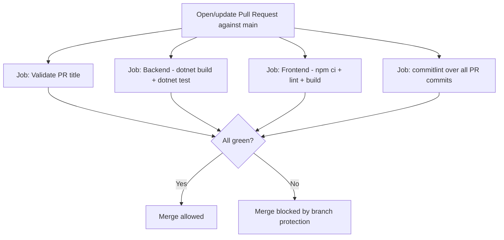

# CI/CD and Version Control Practices

> Complements [`ARCHITECTURE.md`](./ARCHITECTURE.md) §7 (deployment pipeline). This document covers what happens *before* that stage: commit conventions, local hooks, and continuous integration on pull requests.

## 1. Commit convention: Gitmoji + Conventional Commits

The canonical commit format and the full gitmoji↔type mapping table live in [`CLAUDE.md`](./CLAUDE.md) under "Commit Message Instructions" — that's the single source of truth (Claude Code reads it directly when asked to commit; humans should follow the same table). This section only covers how that convention gets *enforced*.

Format, for reference:

```
<gitmoji> <type>(<scope>): <description>

[optional body — explain WHY, not what]

[optional footer — BREAKING CHANGE: description]
```

## 2. Why this convention, beyond aesthetics

- **Scannable `git log`**: the emoji gives instant visual category without reading text.
- **Enables future automation**: with Conventional Commits respected semantically (not just in shape — `feat`/`fix`/`BREAKING CHANGE` meant literally), tools like `release-please` or `semantic-release` can generate version bumps and `CHANGELOG.md` automatically. No need to wire that up now, but adopting the convention from day one keeps that door open at no cost (see §8).

## 3. Local git hooks (Husky)

The repo is polyglot (.NET backend, Vue frontend), so hooks are managed with **Husky** (the npm package, not Husky.Net) from the repo root — `commitlint` is a Node tool regardless, so Node tooling is already a dependency for hooks; using one Husky for everything avoids running two separate hook systems.

### 3.1 Setup

```bash
npm init -y                      # root-level tooling package.json, not published
npm install --save-dev husky @commitlint/cli @commitlint/config-conventional lint-staged
npx husky init
```

This creates `.husky/`, version-controlled alongside the code — anyone who clones the repo and runs `npm install` gets the hooks active automatically (Husky v9+ hooks into `npm install` via the `prepare` script).

### 3.2 `commit-msg` — validates the format with commitlint

`.husky/commit-msg`:
```sh
npx --no -- commitlint --edit "$1"
```

`commitlint.config.js` — enforces both the header shape *and* that the chosen emoji actually matches the declared type (not just "any emoji"), mirroring the table in `CLAUDE.md`:

```js
/** Real emoji (not shortcode) at the start, then conventional type, optional scope, colon, description */
const HEADER_PATTERN =
  /^(\p{Emoji_Presentation}|\p{Extended_Pictographic})\s(\w+)(?:\(([\w./-]+)\))?(!)?:\s(.+)$/u;

// Mirrors the table in CLAUDE.md — keep both in sync if it changes.
const GITMOJI_BY_TYPE = {
  feat: ['✨', '💄', '♿️', '🚸', '📱', '🌐', '🚩', '🛂', '💫', '💥'],
  fix: ['🐛', '🚑️', '🩹', '🔒️', '✏️', '🥅', '👽️'],
  perf: ['⚡️'],
  refactor: ['♻️', '🔥', '⚰️', '🗑️', '🚚', '🏗️', '🦺'],
  docs: ['📝', '📄', '💡', '💬'],
  style: ['🎨', '🚨'],
  test: ['✅', '🧪', '📸'],
  build: ['📦️', '➕', '➖', '⬆️', '⬇️', '📌', '🏷️'],
  chore: ['🔧', '🔨', '🙈', '🍱', '🔊', '🔇'],
  ci: ['👷', '💚', '🚀', '🧱', '🩺'],
  revert: ['⏪️'],
};

module.exports = {
  extends: ['@commitlint/config-conventional'],
  parserPreset: {
    parserOpts: {
      headerPattern: HEADER_PATTERN,
      headerCorrespondence: ['emoji', 'type', 'scope', 'breaking', 'subject'],
    },
  },
  plugins: [
    {
      rules: {
        'gitmoji-type-match': (parsed) => {
          const { emoji, type } = parsed;
          if (!emoji || !type) return [false, 'Commit header must start with a gitmoji, followed by a conventional type'];
          const allowed = GITMOJI_BY_TYPE[type];
          if (!allowed) return [false, `Unknown type "${type}"`];
          return [
            allowed.includes(emoji),
            `Emoji "${emoji}" doesn't match type "${type}" — allowed for this type: ${allowed.join(' ')}`,
          ];
        },
      },
    },
  ],
  rules: {
    'type-enum': [2, 'always', Object.keys(GITMOJI_BY_TYPE)],
    'gitmoji-type-match': [2, 'always'],
    'subject-empty': [2, 'never'],
    'subject-full-stop': [2, 'never', '.'],
    'header-max-length': [2, 'always', 100],
  },
};
```

Note: `subject-case` is intentionally left unset — per `CLAUDE.md`, the description may start with either uppercase or lowercase.

### 3.3 `pre-commit` — builds before allowing the commit

`.husky/pre-commit`:
```sh
echo "→ Building backend (.NET)..."
dotnet build --nologo || { echo "✗ Backend build failed — commit aborted"; exit 1; }

echo "→ Building frontend (Vue)..."
npm --prefix ./frontend run build || { echo "✗ Frontend build failed — commit aborted"; exit 1; }
```

Does exactly what was asked: if either build fails, the commit doesn't happen (a non-zero exit in a Husky hook aborts the commit).

**Performance note, for an informed call**: compiling both full projects on every commit is correct but gets slow as the codebase grows — on a large repo this can discourage small, frequent commits, which is exactly what the commit convention above is trying to encourage. A common community alternative: keep `pre-commit` to fast checks on staged files only (`lint-staged` — ESLint/Prettier on the frontend, `dotnet format --verify-no-changes` on the backend), and move the full build to a `pre-push` hook (runs less often than commits). Noted here, not changed — ship the setup as requested first, migrate to this if the build starts to hurt.

### 3.4 Interactive commit assistant (optional)

[`gitmoji-cli`](https://github.com/carloscuesta/gitmoji-cli) is the official tool from the Gitmoji project itself — `gitmoji -c` opens an interactive emoji picker and walks through the rest of the message. Cuts down on picking the wrong emoji or forgetting the conventional type. Its config (`.gitmojirc.json`) needs to line up with the pattern enforced in `commitlint.config.js` above — check your installed version's default output format before assuming it already matches; adjust via its config file if not.

## 4. Continuous Integration (GitHub Actions) — pull request validation



- **PR title validation**: if the team squash-merges (recommended, to keep `main` at one commit per PR), the PR title becomes the final commit — so it must follow the convention too. [`amannn/action-semantic-pull-request`](https://github.com/amannn/action-semantic-pull-request) validates this against Conventional Commits; feed it the same type list used by commitlint.
- **commitlint over the PR range**: `npx commitlint --from origin/main --to HEAD` validates every individual commit in the PR, not just the final title — useful if squash merge isn't enforced.
- **Backend**: `dotnet build` + `dotnet test`, with a minimum coverage gate to be defined later.
- **Frontend**: `npm ci && npm run lint && npm run build`.

All of this runs on GitHub Actions within the free tier (included minutes are plenty at this project's volume) — no added cost against the Azure credit.

## 5. Branch protection and branching strategy

- **Simplified trunk-based**: short-lived feature branches (`feat/short-name`) off `main`, PR required to merge back, no permanent `develop`/`release` branches — full GitFlow is more process than this team size needs.
- **Protection rule on `main`**: block direct pushes, require CI checks (§4) to pass before merge, require a PR (even if self-approved while working solo for now).
- **Squash merge** by default, so `main`'s history is one clean commit per feature, using the PR title (already validated by `action-semantic-pull-request`) as the message.

## 6. Ongoing maintenance: Dependabot

Minimal config in `.github/dependabot.yml`, free on any GitHub repo:

```yaml
version: 2
updates:
  - package-ecosystem: "nuget"
    directory: "/backend"
    schedule:
      interval: "weekly"
  - package-ecosystem: "npm"
    directory: "/frontend"
    schedule:
      interval: "weekly"
  - package-ecosystem: "github-actions"
    directory: "/"
    schedule:
      interval: "weekly"
```

Particularly relevant here because, having dropped the WAF for cost reasons ([`ARCHITECTURE.md`](./ARCHITECTURE.md) §11), keeping dependencies patched is one of the few extra security layers that's still free and partly offsets that trade-off.

## 7. Deployment: no long-lived secrets

When wiring GitHub Actions to Azure for the deployment job (`ARCHITECTURE.md` §7), use **OIDC / Workload Identity Federation** (`azure/login@v2` with `client-id`/`tenant-id`/`subscription-id` and `permissions: id-token: write`) instead of storing a long-lived Service Principal secret in GitHub Secrets. This is Microsoft's recommended practice, free, and removes a persistent credential that would otherwise be a high-value target if the repo were ever compromised.

## 8. Optional, later: automated versioning and changelog

Once Conventional Commits is respected for real (not just the shape, the semantics too), [`release-please`](https://github.com/googleapis/release-please) or `semantic-release` can be added with almost no extra work: they read the commit history, compute the next semantic version (`feat` → minor, `fix` → patch, `BREAKING CHANGE`/`!` → major), and generate `CHANGELOG.md` on their own. Not needed now — noted here because it's the natural next step from the commit convention already being adopted, whenever formal release versioning matters.

## 9. Tooling summary

| Tool | Role | Cost |
|---|---|---|
| Husky (npm) | Orchestrates git hooks (`pre-commit`, `commit-msg`) | Free |
| commitlint | Validates gitmoji + conventional commit format, and emoji↔type match | Free |
| lint-staged | Fast lint on staged files only (if the §3.3 optimization is adopted) | Free |
| gitmoji-cli | Optional interactive commit assistant | Free |
| GitHub Actions | CI (build/test/lint per PR) and CD (build image + deploy) | Free (included tier) |
| `amannn/action-semantic-pull-request` | Validates PR title against Conventional Commits | Free |
| Dependabot | Dependency updates | Free |
| Azure OIDC (Workload Identity Federation) | Authenticates GitHub Actions to Azure without secrets | Free |
| release-please / semantic-release (optional, later) | Automated versioning and changelog from commits | Free |
