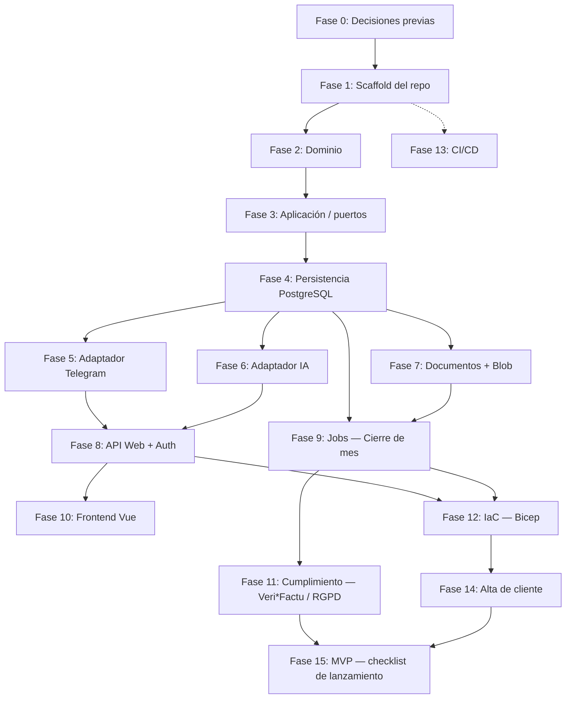

# Plan de Implementación — ClinicBot Core

> Deriva de [`README.md`](./README.md) (producto), [`ARCHITECTURE.md`](./ARCHITECTURE.md) (arquitectura técnica) y [`CI_CD.md`](./CI_CD.md) (control de versiones y pipelines). No repite esas decisiones — cada fase enlaza a la sección que la justifica. Es el documento que convierte el diseño cerrado en una secuencia de trabajo ejecutable, de un repositorio vacío a un MVP desplegado para el primer cliente.

## Cómo usar este documento

- Las fases están ordenadas por **dependencia técnica real**, no por prioridad de producto: el dominio no puede probarse sin entidades, la persistencia no tiene sentido sin dominio, el cierre de mes no puede probarse sin persistencia + reglas, etc.
- Cada fase tiene un **criterio de salida** verificable (build, test, o comando concreto) — no se avanza a la siguiente fase sin cumplirlo, salvo que se indique explícitamente que dos fases pueden solaparse.
- Las fases 2–4 (Dominio → Aplicación → Persistencia) son las únicas estrictamente secuenciales al principio. A partir de la fase 5, varios bloques de infraestructura (Telegram, IA, Documentos) son paralelizables entre sí porque son adaptadores intercambiables del mismo puerto.
- Este documento **debe actualizarse** según avance la implementación: marcar fases completas, ajustar la que esté "en curso", y — llegado el momento de la Fase 1 — actualizar `CLAUDE.md` con los comandos reales de build/test que hoy no existen.

---

## Fase 0 — Decisiones previas al primer commit de código

Bloquea el arranque si no se resuelven; son de coste/plataforma, no de diseño (ver `ARCHITECTURE.md` §10).

- [ ] Verificar disponibilidad de **Azure Container Apps** y **PostgreSQL Flexible Server** (con tier gratuito de 12 meses) en **Spain Central**; si falta cobertura, fijar **West Europe** como región definitiva antes de escribir cualquier plantilla Bicep.
- [ ] Crear la alerta de presupuesto en **Azure Cost Management** — requisito duro antes de cualquier despliegue, no después (crédito Azure for Students sin recarga).
- [ ] Decidir el formato exacto de numeración de factura (`[Prefijo]-[Mes]-[Contador]-[Año]`) y los campos mínimos configurables por defecto (Paciente, Procedencia, Importe, Método de pago…) — decisión de producto que condiciona el esquema de validación de la Fase 3.
- [ ] Confirmar el modelo inicial de Azure AI Foundry a usar (ej. GPT-4o-mini o Mistral Small) — condiciona la Fase 6.

**Salida:** región fijada, alerta de presupuesto activa, esquema mínimo de campos documentado (puede vivir como ADR corto o añadirse a `ARCHITECTURE.md` §10 cuando se resuelva).

---

## Fase 1 — Scaffold del repositorio

Objetivo: pasar de "solo documentación" a una solución que compila, con la estructura hexagonal ya trazada aunque los proyectos estén vacíos.

- [ ] Crear la solución .NET: `dotnet new sln -n ClinicBotCore`.
- [ ] Crear proyectos vacíos siguiendo la separación de capas de `ARCHITECTURE.md` §2:
  - `src/ClinicBot.Domain` (classlib, **sin** referencias a paquetes de infraestructura)
  - `src/ClinicBot.Application` (classlib; referencia `Domain`; añade MediatR)
  - `src/ClinicBot.Infrastructure.Persistence` (classlib; EF Core + Npgsql)
  - `src/ClinicBot.Infrastructure.Telegram`
  - `src/ClinicBot.Infrastructure.AI` (cliente Azure AI Foundry)
  - `src/ClinicBot.Infrastructure.Documents` (ClosedXML + QuestPDF)
  - `src/ClinicBot.Infrastructure.Storage` (Blob Storage)
  - `src/ClinicBot.Api` (ASP.NET Core Web API — host de composición)
  - `tests/ClinicBot.Domain.Tests`, `tests/ClinicBot.Application.Tests`, `tests/ClinicBot.IntegrationTests`
- [ ] Añadir un test de arquitectura (ej. `NetArchTest` o `ArchUnitNET`) que falle el build si `Domain` referencia cualquier paquete de infraestructura — hace cumplir el Principio de diseño 1 (`ARCHITECTURE.md` §1) automáticamente en vez de por disciplina.
- [ ] Scaffold del frontend: `npm create vue@latest frontend`.
- [ ] Configurar herramientas de repo raíz (`CI_CD.md` §3.1): `npm init -y`, Husky, commitlint, lint-staged; copiar `commitlint.config.js` tal como está documentado.
- [ ] `.gitignore` para .NET + Node; `Dockerfile` inicial para `ClinicBot.Api` (multi-stage, imagen final mínima).
- [ ] Reemplazar en `CLAUDE.md` la sección "Project state" con los comandos reales (`dotnet build`, `dotnet test`, `npm run build`, etc.) — este documento pasa a estar desactualizado en cuanto exista código, y `CLAUDE.md` lo señala explícitamente.

**Salida:** `dotnet build` y `npm --prefix frontend run build` compilan en verde sobre proyectos vacíos; hooks de Husky activos tras `npm install`.

---

## Fase 2 — Dominio (núcleo de negocio, sin infraestructura)

Corresponde al bloque `Dominio` de `ARCHITECTURE.md` §2 y al modelo de `ARCHITECTURE.md` §3. Es la fase con más superficie de test unitario puro — sin mocks de infraestructura porque no hay infraestructura que mockear.

1. **Entidades** (`ClinicBot.Domain/Entities`):
   - [ ] `Centro` (id, nombre, `facturacion_agrupada`)
   - [ ] `Sesion` (id, fecha, paciente, procedencia, método de pago, importe, `estado_contable`) — modelar `estado_contable` como estado explícito (`Registrada` → `Facturado` | `Purgado`), nunca como campo libre.
   - [ ] `Gasto` (id, fecha, proveedor, concepto, base imponible, % impuesto, URL recibo)
   - [ ] `Factura` (id, número, fecha de emisión, `hash_anterior`, `hash_actual`) — el cálculo del hash se implementa aquí como método de dominio puro (input determinista → output determinista), aunque el *cuándo* se invoca vive en la Fase 9.
2. **Invariantes del log de eventos**:
   - [ ] Modelar `Sesion`/`Gasto` como *append-only*: sin setters públicos tras la creación; cualquier cambio de estado (ej. `Facturado`/`Purgado`) se representa como una transición explícita, nunca como reescritura de campos existentes — es el principio de inmutabilidad de `ARCHITECTURE.md` §1 aplicado al modelo, no solo a la tabla.
3. **Motor de reglas de negocio** (`ClinicBot.Domain/Rules`):
   - [ ] Regla por método de pago: qué métodos se facturan al 100% automáticamente — parametrizable, no hardcodeado (se alimenta de configuración por clínica vía JSONB, pero el *tipo* de regla es dominio).
   - [ ] Regla de facturación agrupada por centro: si `Centro.facturacion_agrupada`, las sesiones del periodo se agrupan en una única factura a nombre de la entidad.
4. **Algoritmo de cuadre de caja** (`ClinicBot.Domain/CuadreDeCaja`):
   - [ ] Dado un importe objetivo + lista de sesiones en efectivo del periodo, selección aleatoria hasta igualar o superar el objetivo; el resto se marca `Purgado`.
   - [ ] La semilla aleatoria es un **parámetro de entrada explícito** del algoritmo (nunca `Random` sin semilla) — es lo que hace auditable "por qué se purgó esta sesión y no otra" (`ARCHITECTURE.md` §2). El caller (Fase 9) decide y persiste la semilla; el dominio solo la consume.
5. **Tests unitarios** (`tests/ClinicBot.Domain.Tests`):
   - [ ] Cuadre de caja: mismo input + misma semilla → mismo resultado (determinismo); cobertura de bordes (objetivo mayor que el total disponible, objetivo cero, una sola sesión que ya lo cubre).
   - [ ] Reglas de facturación agrupada y por método de pago con tablas de casos.
   - [ ] Cadena de hash de `Factura`: alterar cualquier campo de una factura ya encadenada invalida el hash de la siguiente.

**Salida:** `ClinicBot.Domain` compila sin ninguna referencia a EF Core, HTTP, ni SDKs de Azure; suite de tests de dominio en verde; test de arquitectura de la Fase 1 pasa.

---

## Fase 3 — Aplicación: casos de uso y puertos

Corresponde al bloque `Aplicación` de `ARCHITECTURE.md` §2. Aquí se definen los **puertos** (interfaces) que la infraestructura implementará después — esta fase no depende de que exista Postgres, Telegram o el modelo de IA reales.

- [ ] Definir puertos en `ClinicBot.Application/Ports`:
  - `IEventRepository` (persistencia del log append-only)
  - `IExtractorService` (extracción de datos desde texto/imagen vía IA)
  - `IDocumentStorage` (subida a almacenamiento cloud)
- [ ] Casos de uso vía MediatR (`ClinicBot.Application/UseCases`):
  - `RegistrarSesionCommand` / Handler — valida campos mínimos configurados por clínica (Fase 0), persiste vía `IEventRepository`.
  - `RegistrarGastoCommand` / Handler — idem para gastos.
  - `CerrarMesCommand` / Handler — orquesta lectura del periodo, aplicación de reglas de dominio, cuadre de caja, marcado de estado y disparo de generación documental. **No** contiene lógica de negocio propia: delega en el motor de reglas y el algoritmo de dominio de la Fase 2.
- [ ] Validación dinámica de campos mínimos: modelar como servicio de aplicación que lee la configuración JSONB de la clínica y devuelve qué campos faltan — es la pieza que permite la conversación de re-pregunta descrita en `README.md` §1 y en el flujo de `ARCHITECTURE.md` §4.
- [ ] Tests con dobles de prueba (fakes/mocks) de los tres puertos — verifican orquestación, no infraestructura real.

**Salida:** `ClinicBot.Application` compila referenciando solo `Domain` + MediatR; los tres casos de uso tienen tests de orquestación en verde usando implementaciones falsas de los puertos.

---

## Fase 4 — Infraestructura: persistencia PostgreSQL

Implementa `IEventRepository`. Corresponde a `ARCHITECTURE.md` §3, §6 y §8 (fila "Base de datos").

- [ ] Modelo EF Core en `ClinicBot.Infrastructure.Persistence` mapeando `Sesion`, `Gasto`, `Factura`, `Centro` — tabla de eventos **append-only**: sin `UPDATE`/`DELETE` en el código de aplicación sobre filas ya insertadas; el cambio de `estado_contable` se hace como se decidió en la Fase 2 (transición explícita, no mutación libre).
- [ ] Columna(s) `JSONB` para configuración por clínica (campos mínimos, reglas de método de pago, centros con facturación agrupada) — sin migraciones nuevas cada vez que una clínica cambia su configuración.
- [ ] Migraciones EF Core iniciales; connection string parametrizada (una base de datos por cliente, mismo servidor compartido — `ARCHITECTURE.md` §6).
- [ ] Implementar `IEventRepository` sobre este `DbContext`.
- [ ] Tests de integración (`tests/ClinicBot.IntegrationTests`) contra Postgres real en contenedor (Testcontainers) — no contra SQLite en memoria, para no enmascarar comportamiento específico de Postgres (JSONB, tipos de fecha).
- [ ] Confirmar que **EF Core siempre parametriza** (nunca SQL concatenado) — es una mitigación de seguridad explícita en ausencia de WAF (`ARCHITECTURE.md` §9), no solo buena práctica.

**Salida:** `dotnet ef database update` crea el esquema en una instancia Postgres local/contenedor; `RegistrarSesionCommand`/`RegistrarGastoCommand` persisten de extremo a extremo en el test de integración.

---

## Fase 5 — Adaptador de canal: Telegram

Implementa el canal de entrada del MVP (`README.md` "Canal de entrada"; `ARCHITECTURE.md` §4). Paralelizable con las Fases 6 y 7.

- [ ] Cliente Telegram Bot API en modo **long polling** (sin webhook público — decisión de superficie de ataque de `ARCHITECTURE.md` §6/§9).
- [ ] Traducir updates de Telegram (texto, foto) a los comandos MediatR de la Fase 3.
- [ ] Flujo conversacional de "solicitud de corrección" cuando faltan campos obligatorios (secuencia completa en `ARCHITECTURE.md` §4).
- [ ] Manejo de fotos: descarga del archivo de Telegram → bytes a `IExtractorService` (puerto, aún sin implementación real hasta la Fase 6 — se puede probar con un fake que devuelve JSON fijo).
- [ ] Tests de integración del flujo mensaje → comando → confirmación, con Telegram real mockeado a nivel HTTP.

**Salida:** un bot de pruebas responde a mensajes de texto y fotos en un chat de Telegram real (entorno de desarrollo), registrando eventos en la base de datos de la Fase 4.

---

## Fase 6 — Adaptador de IA: Azure AI Foundry

Implementa `IExtractorService`. Corresponde a `ARCHITECTURE.md` §2, §8 (fila "IA").

- [ ] Cliente contra Azure AI Foundry, modelo configurado en la Fase 0 — el nombre del modelo/proveedor debe leerse de configuración (`appsettings`/Key Vault), nunca hardcodeado, para poder cambiarlo sin tocar código (`ARCHITECTURE.md` §1).
- [ ] Prompt/función de clasificación de intención (sesión / gasto / comando de sistema).
- [ ] Prompt/función de extracción estructurada desde imagen de ticket (fecha, proveedor, concepto, importes) con nivel de confianza por campo.
- [ ] Prompt/función de validación conversacional (qué re-preguntar cuando falta un campo).
- [ ] Manejo de errores del proveedor de IA sin filtrar detalles internos al usuario final por Telegram.
- [ ] Tests de contrato: fijar el esquema de JSON esperado de la respuesta del modelo y testear el parseo/mapeo a los DTOs de aplicación de forma aislada (sin llamar al modelo real en cada test run).

**Salida:** una foto de ticket real, subida por Telegram (Fase 5), produce un evento de `Gasto` correctamente poblado en la base de datos, con re-pregunta automática si falta un campo obligatorio.

---

## Fase 7 — Generación documental y almacenamiento cloud

Implementa `IDocumentStorage` + el motor de generación de documentos. Corresponde a `README.md` §5 y `ARCHITECTURE.md` §5, §8.

- [ ] Generación de Excel **Maestro** (ClosedXML) — proyección en tiempo real desde el log de eventos, regenerable en cualquier momento sin efectos secundarios (es una vista derivada, no una fuente de verdad — Principio 2 de `ARCHITECTURE.md` §1).
- [ ] Generación de Excel **Oficial** (ClosedXML) — aplicado sobre el resultado del cierre de mes (Fase 9): solo sesiones `Facturado`, purga de las `Purgado`.
- [ ] Generación de facturas PDF (QuestPDF) — plantilla con numeración `[Prefijo]-[Mes]-[Contador]-[Año]` (formato fijado en Fase 0). **Verificar el umbral de licencia Community de QuestPDF** antes de escalar a producción (nota explícita en `ARCHITECTURE.md` §8) — decisión a tomar aquí, no después.
- [ ] Implementar `IDocumentStorage` sobre Azure Blob Storage, dedicado por cliente (`ARCHITECTURE.md` §6).
- [ ] Jerarquía de carpetas Año/Trimestre/Mes al subir documentos — creación idempotente (no falla si la carpeta ya existe).
- [ ] Tests de integración contra Azurite (emulador local de Blob Storage) para no gastar crédito de Azure en cada test run.

**Salida:** dado un conjunto de eventos de prueba, se genera un Excel Maestro, un Excel Oficial y un PDF de factura válidos, y quedan subidos en la jerarquía de carpetas esperada en el emulador local.

---

## Fase 8 — API Web + autenticación

Host de composición (`ClinicBot.Api`) que cablea los adaptadores anteriores. Corresponde a `ARCHITECTURE.md` §6, §8, §9.

- [ ] Inyección de dependencias: registrar las implementaciones concretas de los tres puertos según la Fase 4/6/7 en `Program.cs`.
- [ ] Endpoints REST mínimos para el portal web: `POST /sesiones`, `POST /gastos`, `POST /cierres`, `GET /cierres/{id}` (estado del job).
- [ ] Autenticación con **Microsoft Entra External ID** — clientes modelados como organizaciones separadas (`ARCHITECTURE.md` §6); el claim de organización del usuario autenticado determina a qué Container App/base de datos de cliente se enruta.
- [ ] **Rate limiting nativo de ASP.NET Core** en la API — mitigación explícita por la ausencia de WAF (`ARCHITECTURE.md` §9), no opcional.
- [ ] Health checks básicos (`/health`) para los smoke tests post-deploy de la Fase 13.
- [ ] Tests de integración de los endpoints con `WebApplicationFactory`.

**Salida:** la API expone los tres endpoints protegidos por Entra, responde `200` en `/health`, y rechaza tráfico por encima del límite de rate limiting configurado.

---

## Fase 9 — Jobs: cierre de mes (Hangfire)

Corresponde al flujo completo de `ARCHITECTURE.md` §5.

- [ ] Configurar Hangfire sobre la misma instancia Postgres (`ARCHITECTURE.md` §8, fila "Motor de jobs") — sin infraestructura de colas adicional.
- [ ] `CerrarMesCommand` (Fase 3) se encola como job de Hangfire desde `POST /cierres`.
- [ ] **Idempotencia real, no solo declarada**: el job debe poder reintentarse a mitad de ejecución sin duplicar facturas ni romper el encadenado de hashes — esto probablemente requiere una tabla de "cierre en curso" con estado propio (ej. `Iniciado` → `ReglasAplicadas` → `DocumentosGenerados` → `Completado`) para saber desde dónde reanudar. Diseñarlo explícitamente en esta fase, no dar por hecho que Hangfire lo resuelve solo.
- [ ] Generar y **persistir la semilla aleatoria** usada por el algoritmo de cuadre de caja (Fase 2) junto con el resultado del cierre — es el dato que hace auditable la purga.
- [ ] Cálculo del hash encadenado de `Factura` (Veri*Factu) en el momento de generación, aislado por cliente (cada base de datos de cliente tiene su propia cadena — nunca cruza clientes).
- [ ] Notificación de cierre completado de vuelta al portal web.
- [ ] Tests de idempotencia: simular un fallo a mitad del job (ej. tras aplicar reglas pero antes de generar documentos) y verificar que un reintento completa sin duplicar ni romper la cadena de hashes.

**Salida:** ejecutar `CerrarMesCommand` dos veces seguidas sobre el mismo periodo (simulando un reintento) no duplica facturas ni invalida la cadena de hashes; el Excel Oficial y los PDFs quedan en Blob Storage; el Excel Maestro sigue reflejando el 100% de la actividad sin verse afectado por la purga.

---

## Fase 10 — Frontend: portal web (Vue.js)

Corresponde a `README.md` "Canal de entrada" y `ARCHITECTURE.md` §6, §8. Puede empezar en paralelo a la Fase 9 una vez la Fase 8 expone endpoints estables.

- [ ] Login contra Entra External ID; enrutado según el claim de organización.
- [ ] Vista de registro manual de sesiones/gastos (alternativa a Telegram para el staff).
- [ ] Vista de disparo de "Cierre de mes" con input del importe objetivo de caja.
- [ ] Vista de estado del cierre (polling o notificación) y enlaces de descarga a los documentos generados.
- [ ] Vista de configuración por clínica: campos mínimos, reglas por método de pago, centros con facturación agrupada — interfaz sobre la configuración JSONB de la Fase 4.
- [ ] `npm run lint` + `npm run build` en verde, integrado con los hooks de la Fase 1.

**Salida:** un usuario autenticado puede, desde el navegador, disparar un cierre de mes y descargar el resultado, sin tocar Telegram.

---

## Fase 11 — Endurecimiento de cumplimiento (Veri*Factu / RGPD)

No es una fase de features nuevas: es una auditoría de lo construido en las Fases 4–9 contra los requisitos de `ARCHITECTURE.md` §9 antes de manejar datos reales de clínicas.

- [ ] Auditar que ningún dato de paciente llega a Application Insights (solo metadatos técnicos) — revisar todos los `logger.Log*` de las fases anteriores.
- [ ] Confirmar residencia de datos: región de Postgres y Blob Storage = la fijada en la Fase 0 (UE).
- [ ] Confirmar que Key Vault y Blob Storage no tienen acceso público directo.
- [ ] Verificar que la cadena de hash de `Factura` es reconstruible e íntegra end-to-end (test que recorre una cadena completa de un cliente simulado y detecta manipulación de cualquier eslabón).
- [ ] Revisar control de acceso: un usuario autenticado de la Organización A nunca puede alcanzar, ni por API ni por IDOR, datos de la Organización B (test de integración específico, dado que el aislamiento es físico por base de datos — un fallo aquí sería un bypass del modelo de tenancy, no un bug menor).

**Salida:** checklist de esta fase firmada; test de aislamiento cross-tenant en verde.

---

## Fase 12 — Infraestructura como código (Bicep)

Corresponde a `ARCHITECTURE.md` §6, §7, §11.

- [ ] Plantilla Bicep de infraestructura **compartida**: Static Web App (Free), Container Apps Environment (Consumption), Entra External ID, servidor PostgreSQL Flexible Server (Burstable mínimo), Application Insights.
- [ ] Plantilla Bicep **parametrizada por cliente**: Resource Group + Container App + base de datos (catálogo) en el servidor compartido + Blob Storage + Key Vault.
- [ ] Explícitamente **sin** Front Door/WAF (`ARCHITECTURE.md` §6/§11) — no añadir "por si acaso".
- [ ] Alerta de presupuesto en Cost Management como parte del propio despliegue (no manual y aparte, para que no se olvide en el alta de un cliente nuevo).
- [ ] Documentar el proceso de alta de cliente como comando único (ver Fase 14).

**Salida:** `az deployment` de la plantilla compartida crea el entorno base; una segunda plantilla crea el Resource Group de un cliente de prueba, todo en la región fijada en la Fase 0.

---

## Fase 13 — CI/CD (GitHub Actions)

Puede montarse en paralelo a partir de la Fase 1 (no depende de que el dominio esté terminado) y se va enriqueciendo según avanzan las fases. Corresponde a `CI_CD.md` completo.

- [ ] Workflow de PR (`CI_CD.md` §4): validación de título (`amannn/action-semantic-pull-request`), `dotnet build` + `dotnet test`, `npm ci && npm run lint && npm run build`, `commitlint` sobre el rango de commits del PR.
- [ ] Protección de rama `main`: bloqueo de push directo, checks obligatorios, squash merge por defecto (`CI_CD.md` §5).
- [ ] `dependabot.yml` para nuget, npm y github-actions (`CI_CD.md` §6).
- [ ] Workflow de deploy (`ARCHITECTURE.md` §7): build de imagen Docker → push a GitHub Container Registry → deploy Bicep parametrizado por cliente destino → smoke tests post-deploy contra `/health` (Fase 8).
- [ ] Autenticación del workflow de deploy contra Azure vía **OIDC/Workload Identity Federation** (`CI_CD.md` §7) — sin Service Principal secret en GitHub Secrets.
- [ ] (Opcional, más adelante) `release-please`/`semantic-release` una vez el histórico de commits sea semánticamente fiable (`CI_CD.md` §8) — no bloquea el MVP.

**Salida:** un PR contra `main` no puede fusionarse sin pasar los cuatro checks; un merge a `main` produce un despliegue automático seguido de smoke test en verde.

---

## Fase 14 — Automatización de alta de cliente

Cierra el círculo entre la Fase 12 (Bicep) y la operación real con múltiples clínicas (`ARCHITECTURE.md` §6, último párrafo).

- [ ] Script/workflow que ejecuta la plantilla Bicep parametrizada, registra el nuevo Resource Group contra el Environment/GHCR/Entra existentes, y crea la base de datos del cliente en el servidor compartido.
- [ ] Seed inicial de configuración JSONB del cliente (campos mínimos, reglas por defecto) desde un formulario o fichero de onboarding.
- [ ] Runbook corto: pasos manuales restantes tras ejecutar el script (si los hay) — apuntar a "cero pasos manuales" como objetivo, pero documentar lo que quede.

**Salida:** dar de alta un segundo cliente de prueba no requiere tocar la plantilla Bicep a mano, solo parámetros.

---

## Fase 15 — MVP: checklist de lanzamiento

No añade funcionalidad — es la puerta de salida antes de operar con datos reales de una clínica.

- [ ] Fases 0–13 completas para al menos un cliente end-to-end: registrar sesión por Telegram con foto de ticket → cierre de mes con importe objetivo → Excel Oficial + PDFs correctos en Blob → factura con hash encadenado válido.
- [ ] Fase 11 (checklist de cumplimiento) firmada.
- [ ] Alerta de presupuesto de Azure Cost Management verificada activa (no solo configurada — confirmar que dispara).
- [ ] `CLAUDE.md` actualizado con la estructura de código real y comandos de build/test (pendiente desde la Fase 1, verificar que no quedó desactualizado).
- [ ] Backup/restore de la base de datos del cliente probado al menos una vez (aunque sea manual en esta fase de coste mínimo).

**Salida:** primera clínica real operando sobre el sistema.
