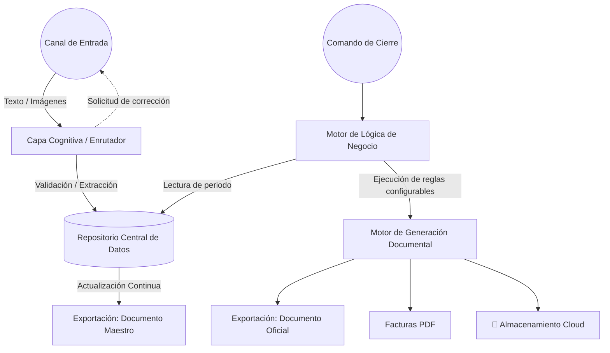

# 🤖 ClinicBot Core (Agente de Facturación Clínica)

> **Agente inteligente multicanal para automatizar la facturación y contabilidad de cualquier tipo de clínica. Procesa mensajes y tickets, gestiona datos estructurados y genera automáticamente facturas PDF y reportes de Excel (Maestro y Oficial) en la nube.**

⚠️ **ESTADO DEL PROYECTO: En fase de definición. Las tecnologías específicas, modelos de IA, infraestructura cloud y arquitectura técnica están PENDIENTES DE DECIDIR.**

---

## 📖 Visión General del Proyecto

Este proyecto define el núcleo funcional de un sistema de automatización contable diseñado para eliminar la carga administrativa en clínicas. A través de una interfaz conversacional (como Telegram, WhatsApp o Web), el agente captura la actividad diaria y orquesta el cierre contable. 

El sistema está diseñado para ser **completamente agnóstico y configurable**, permitiendo adaptar las reglas de negocio, nombres de centros asociados y métodos de pago a las necesidades de cualquier clínica.

## 🚀 Características Principales (Requisitos Funcionales)

### 1. Router Cognitivo (Motor de IA por definir)
- **Clasificación de Intenciones:** Analiza si el usuario registra una sesión, un gasto, o lanza un comando del sistema.
- **Validación Dinámica:** Valida que la información contenga los campos mínimos configurados para la clínica (ej. Paciente, Procedencia, Importe, Método de pago). Solicita de forma conversacional los datos faltantes.
- **Extracción de Datos de Imágenes:** Capacidad de extraer fecha, proveedor, concepto e importes desde fotos de tickets de manera automatizada.

### 2. Base de Datos Centralizada (Tecnología por definir)
- Repositorio estructurado que actúa como fuente única de verdad (SSOT). Guarda el histórico inmutable de interacciones validadas, separando el almacenamiento de datos crudos de las exportaciones.

### 3. Arquitectura de Doble Registro (Libros Mayores)
- **📊 Excel Maestro (Tiempo Real):** Documento sincronizado con la base de datos que refleja el 100% de la actividad y el saldo de caja real. Uso estrictamente interno.
- **📊 Excel Oficial (Diferido):** Documento generado bajo demanda en el cierre contable, aplicando las reglas de purga y facturación definidas. Uso para gestoría/auditoría fiscal.

### 4. Motor de Reglas de Negocio (Configurable)
El proceso de "Cierre de Mes" aplica reglas dinámicas basadas en parámetros configurables:
- **Reglas por Método de Pago:** Configurabilidad para determinar qué métodos (ej. Transferencias, Pagos Digitales, Efectivo) se facturan automáticamente al 100%.
- **Facturación Agrupada por Centro/Procedencia:** Capacidad de configurar ciertas entidades, centros derivados o aseguradoras para que sus sesiones se agrupen en una única factura mensual global a nombre de la entidad.
- **Algoritmo de Cuadre de Caja (Aproximación Superior):** Dada una cantidad objetivo ingresada por el usuario, el sistema selecciona aleatoriamente sesiones abonadas en efectivo hasta igualar o superar el objetivo, apartando o "purgando" el resto en la generación del registro Oficial.

### 5. Gestión Documental Cloud (Integración por definir)
- Generación de facturas en PDF con plantillas y numeración adaptables (ej. `[Prefijo]-[Mes]-[Contador]-[Año]`).
- Creación y mantenimiento de la jerarquía de carpetas por años, trimestres y meses en el sistema de almacenamiento definido.

---

## 🏗 Arquitectura Conceptual (Propuesta Lógica)

*Nota: Este esquema refleja flujos lógicos, no componentes de infraestructura tecnológica definitiva.*

---

## 🛠 Tecnologías y Decisiones Arquitectónicas (PENDIENTES)

Las siguientes áreas técnicas se encuentran en fase de evaluación y **no han sido decididas**. El objetivo es mantener el diseño neutral hasta elegir la combinación más eficiente, segura y escalable:

- **Modelos de Inteligencia Artificial:** Elección del proveedor de LLM (visión y texto) para el router cognitivo.
- **Canales y Frameworks de Entrada:** Aplicación Web, integraciones de mensajería (Telegram, WhatsApp), o desarrollo a medida.
- **Base de Datos:** Elección de modelo (SQL vs NoSQL) y plataforma Cloud.
- **Motor de Ejecución Lógica:** Entornos para ejecutar el algoritmo de cuadre y reglas de negocio (Plataformas Low-Code, Sandboxes de ejecución aislada, o funciones Serverless).
- **Almacenamiento y Archivos:** Proveedor de gestión documental Cloud (ej. Drive, OneDrive, S3) y librerías para la renderización de Excel y PDF.

---

## 📂 Estructura de Datos (Esquema General)

### Registro de Sesiones (Ejemplo Estructural)
| ID Factura | Fecha | Paciente / ID | Procedencia / Entidad | Método Pago | Importe | Estado Contable |
|---|---|---|---|---|---|---|
| F-1001-202X | 01/10 | Paciente A | Centro Asociado 1 | Digital | 50.00 | Facturado |
| - | 02/10 | Paciente B | Particular | Efectivo | 60.00 | Purgado |

### Registro de Gastos (Ejemplo Estructural)
| Fecha | Proveedor | Concepto | Base Imponible | % Impuesto | Total | URL Recibo |
|---|---|---|---|---|---|---|
| 10/10 | Proveedor X | Suministros | 20.00 | XX% | 24.20 | [Enlace] |

---
*Nota: Este documento evolucionará a medida que se tomen decisiones arquitectónicas y tecnológicas definitivas.*
